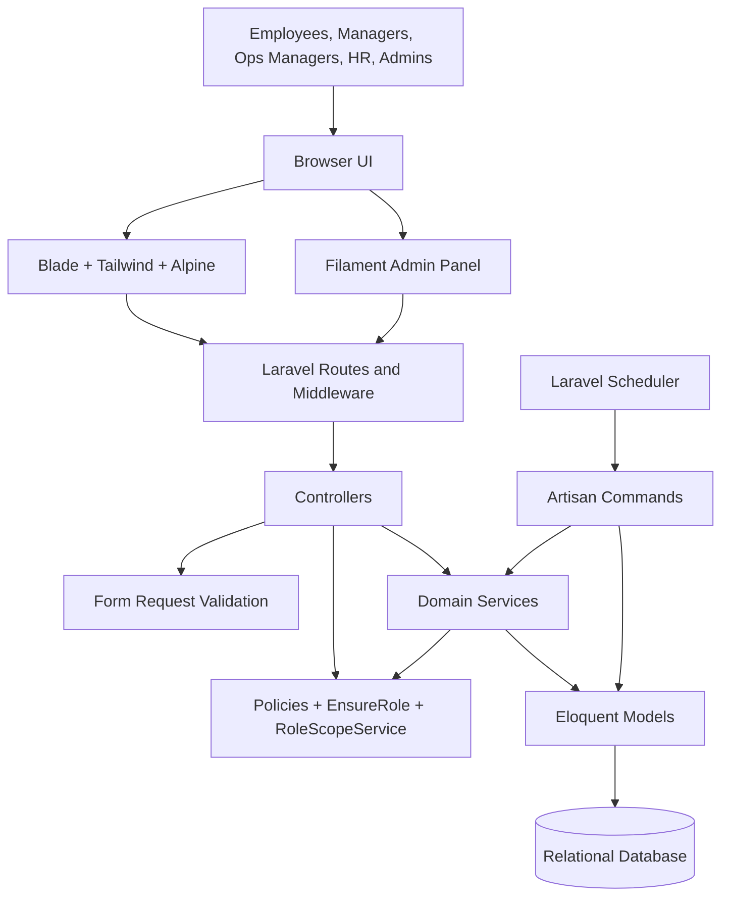
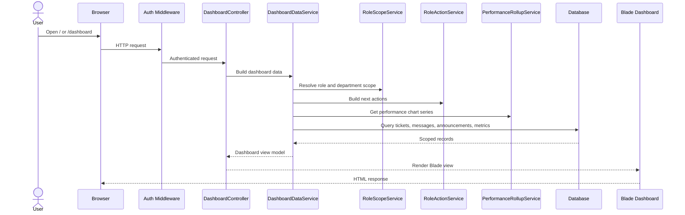
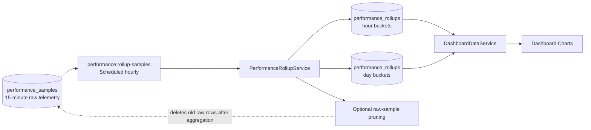
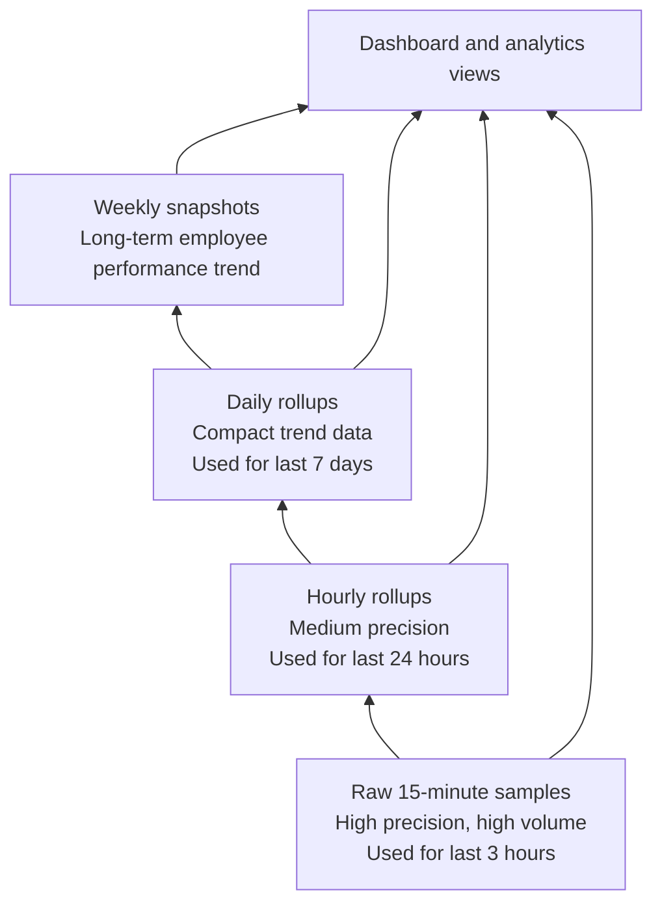
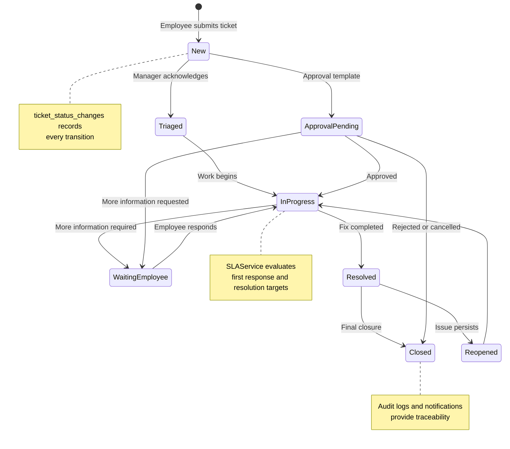
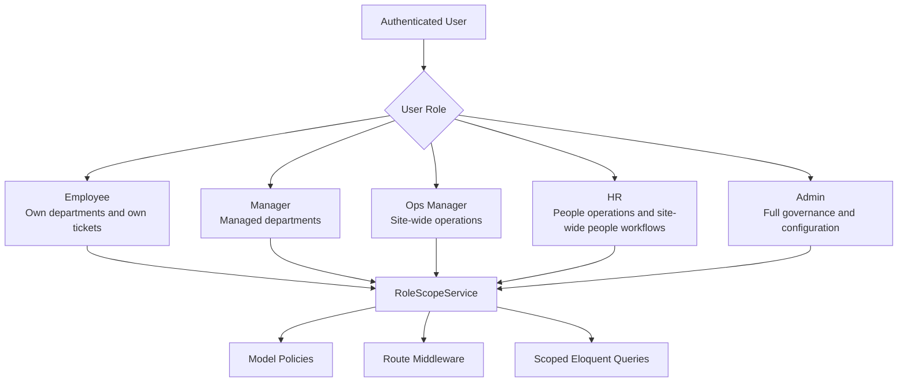
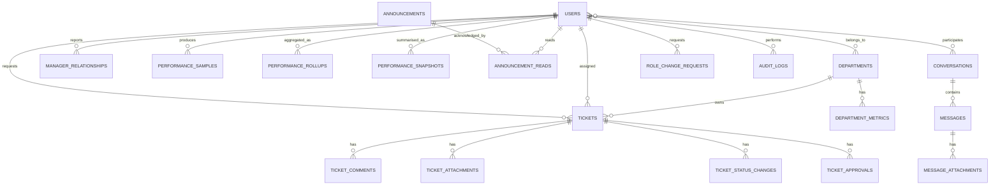
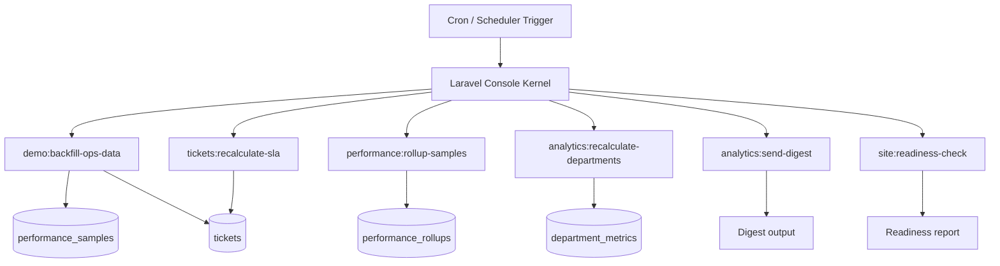

# Prism Diagram Brief For Dissertation Figures

This file is designed to be pasted into OpenAI Prism or another diagram assistant. It contains self-contained context, diagram prompts, Mermaid source blocks, and suggested captions.

## Context For Prism

I am writing a dissertation about a Laravel application called Site Bulletin. It is an internal operations portal for a fulfilment-centre environment. The application supports employees, managers, operations managers, HR, and admins. It includes ticket reporting, SLA tracking, performance analytics, announcements, messaging, governance, notifications, and role-aware dashboards.

The application is a Laravel monolith with:

- Blade/Tailwind/Alpine frontend
- Eloquent models
- Laravel policies and middleware
- service classes for business logic
- Filament admin resources
- scheduled Artisan commands
- SQLite locally, but designed so it can move to production database infrastructure

Important architectural idea:

- Controllers should stay relatively thin.
- Service classes perform business logic and data aggregation.
- Policies and `RoleScopeService` enforce access rules.
- High-volume performance samples are processed into rollups for scalable charting.

## Figure 1: Layered System Architecture

Prompt:

"Create a clean dissertation-quality layered architecture diagram for the Site Bulletin Laravel app. Show users at the top, then presentation layer, HTTP routing/controllers, authorization, service layer, Eloquent models, database tables, and scheduled commands. Emphasise that this is a Laravel monolith with clear internal boundaries."

Mermaid:

Suggested caption:

"Layered architecture of Site Bulletin, showing the separation between presentation, request handling, authorization, service logic, persistence, and scheduled processing."

## Figure 2: Role-Aware Request Lifecycle

Prompt:

"Create a flowchart showing how an authenticated dashboard request is processed. Include auth middleware, dashboard controller, DashboardDataService, role-specific services, database queries, and Blade rendering."

Mermaid:

Suggested caption:

"Request lifecycle for the role-aware dashboard, where a controller delegates data composition to services and each query is constrained by role and department scope."

## Figure 3: High-Volume Performance Data Pipeline

Prompt:

"Create a data pipeline diagram explaining how raw 15-minute employee performance samples are transformed into hourly and daily rollups, then used by dashboard charts. Show raw samples, scheduled rollup command, rollup service, rollup table, dashboard read path, and optional raw retention pruning."

Mermaid:

Suggested caption:

"Scalable performance telemetry pipeline. Raw 15-minute samples are retained for live short-window analysis, while scheduled rollups provide compact hourly and daily data for repeated dashboard chart reads."

## Figure 4: Multi-Resolution Performance Analytics Model

Prompt:

"Create a pyramid or layered data-resolution diagram. Show raw 15-minute samples at the bottom, hourly rollups, daily rollups, weekly snapshots, and dashboard/analytics views at the top. Explain that each layer reduces data volume and supports a different analysis window."

Mermaid:

Suggested caption:

"Multi-resolution analytics model used to balance recent operational precision with scalable historical dashboard reads."

## Figure 5: Ticket Lifecycle And SLA Processing

Prompt:

"Create a ticket lifecycle diagram for a fulfilment-centre operations portal. Show ticket creation, triage, in progress, waiting on employee, resolved/closed, comments, attachments, status history, SLA evaluation, approvals, notifications, and audit logging."

Mermaid:

Suggested caption:

"Ticket lifecycle with SLA and approval processing. Status history provides an auditable record, while SLA flags support fast dashboard filtering."

## Figure 6: Role And Department Scope Model

Prompt:

"Create an access-control diagram showing how employee, manager, operations manager, HR, and admin roles map to department visibility. Include RoleScopeService, policies, and route middleware as enforcement points."

Mermaid:

Suggested caption:

"Role and department-scope model. Access is enforced through middleware, policies, and reusable query scoping rather than isolated controller checks."

## Figure 7: Main Entity Relationship Diagram

Prompt:

"Create an ERD-style diagram for the Site Bulletin application. Focus on users, departments, tickets, ticket status changes, approvals, announcements, conversations, messages, performance samples, performance rollups, department metrics, audit logs, and role change requests."

Mermaid:

Suggested caption:

"Simplified entity relationship view of the operational, communication, analytics, and governance data model."

## Figure 8: Scheduled Processing Architecture

Prompt:

"Create a scheduled-processing diagram for the Laravel application. Show Laravel Scheduler invoking demo data backfill, performance sample rollups, ticket SLA recalculation, department analytics recalculation, analytics digest export, and readiness checks."

Mermaid:

Suggested caption:

"Scheduled processing architecture. Repeated background commands keep analytics, SLA state, performance rollups, and readiness reporting current without placing all computation on user requests."

## Figure 9: Data Volume Reduction Chart Prompt

Prompt:

"Create a bar chart comparing raw performance sample volume against rollup volume for a department of 100 employees across 7 days. Use approximate values: raw 15-minute samples = 28,000 rows, daily rollups = 700 rows, final chart points = 7. Title it 'Performance Chart Data Volume Reduction'."

Suggested chart data:

| Layer | Approximate rows |
|---|---:|
| Raw 15-minute samples | 28000 |
| Daily rollup rows | 700 |
| Final dashboard chart points | 7 |

Suggested caption:

"Approximate data-volume reduction achieved by aggregating raw 15-minute telemetry into daily rollups before dashboard rendering."

## Figure 10: Dissertation Explanation Prompt

Prompt:

"Write a dissertation-ready explanation of why Site Bulletin uses performance rollups. Mention that raw 15-minute telemetry is useful for recent operational monitoring but becomes expensive for repeated dashboard queries as user count grows. Explain that scheduled hourly and daily aggregation reduces query load, supports retention of old raw samples, and provides a multi-resolution analytics design."

Expected key points:

- raw samples are the most detailed data
- raw samples grow linearly with employees and time
- dashboards repeatedly query similar time windows
- rollups move repeated aggregation to scheduled processing
- chart reads become smaller and more predictable
- raw samples can be retained only for recent live views
- daily/hourly rollups preserve historical chart usefulness
- weekly snapshots support longer-term employee performance evaluation
